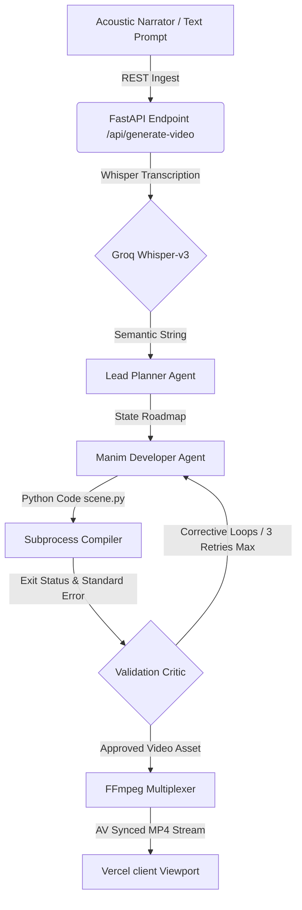

# <p align="center"><br>AlgoFrame AI</p>

<p align="center">
  <strong>Autonomous Data Structure &amp; Algorithm Animation Engine via Multi-Agent Closed-Loop Synthesis</strong>
</p>

<p align="center">
  <a href="https://github.com/kritika-ghosh/AlgoFrame"></a>
  <a href="https://huggingface.co/spaces/kritika53245/AlgoFrame"></a>
  <a href="https://react.dev/"></a>
  <a href="https://manim.community/"></a>
</p>

---

## 🌌 Overview & Vision

Visualizing complex computer memory mutations—such as node rotations in an AVL Tree or pointer updates in a Doubly Linked List—is essential for technical learning but time-consuming to program manually. Standard tools like Manim require significant coding mastery, while general-purpose generative video LLMs frequently hallucinate connections.

**AlgoFrame AI** bridges this gap. It replaces manual keyframing scripts with an **autonomous multi-agent reasoning and validation pipeline**. By combining conversational audio descriptions or text prompts with a mathematical layout engine, it compiles correct, step-by-step vector visualizations directly in the browser within seconds.

---

## 🛠️ The Architecture Stack

AlgoFrame AI operates as a synchronized, closed-loop network split between a FastAPI microservice and a React client:



### Core Systems & AI Concepts Used
1. **Speech Transcription:** Ingests user audio prompts and transcribes them utilizing **Groq's Whisper-v3** speech-to-text model.
2. **Autonomous Multi-Agent Orchestration:** Driven by **CrewAI** agents (Planner, Developer, Auditor) leveraging **LLM reasoning** (Llama-3.3-70B and Gemini-2.5-pro) to map algorithmic descriptions into logical state-machine arrays.
3. **Closed-Loop Self-Healing Validation:** A Validator agent scans Manim compiler logs for syntax exceptions or logical discrepancies. It performs up to 3 automatic corrective code rewrites, eliminating code hallucinations before final compilation.
4. **Headless Vector Graphics Rendering:** Spawns subprocesses running the **Manim** engine to draw mathematical node layouts.
5. **Direct Stream Multiplexing:** Executes **FFmpeg** commands to bind audio tracks directly onto video containers with zero re-encoding time.

---

## 🗂️ Project Structure

```text
AlgoFrame/
│
├── frontend-vercel/            # React Web Interface (Vite 5 + TypeScript + Vanilla CSS)
│   ├── src/
│   │   ├── components/
│   │   │   ├── LandingPage.tsx # Scientist/Programmer portal landing viewport
│   │   │   └── Workspace.tsx   # Dashboard, canvas oscilloscope, terminal logger, player
│   │   ├── App.tsx             # Global state controller and health polling checks
│   │   └── index.css           # Custom dark theme variables, CRT scanline, grids
│   └── package.json
│
└── backend-hf/                 # Hugging Face FastAPI Space (Python 3.10)
    ├── app/
    │   ├── agents/             # Lead Planner, Manim Developer, Critic Validation agents
    │   ├── api/                # Network routers and Pydantic schemas
    │   └── services/           # Whisper transcribe, Manim CLI, FFmpeg muxing drivers
    ├── Dockerfile              # Setup containing FFmpeg, Cairo, and Manim dependencies
    └── requirements.txt
```

---

## ⚡ Quick Start & Deployment

### 🖥️ Run the Web Client (`frontend-vercel`)

Ensure you have [Node.js](https://nodejs.org/) version 20+ installed.

```bash
# 1. Navigate to the client folder
cd frontend-vercel

# 2. Install dependencies
npm install

# 3. Spin up the Vite development server
npm run dev
```
Open `http://localhost:5173` in your browser. The header status tracker will query the space health and display `OPERATIONAL` once ready.

### 🐍 Run the Backend Locally (`backend-hf`)

Ensure you have [Python 3.10+](https://www.python.org/) and [FFmpeg](https://ffmpeg.org/) installed.

```bash
# 1. Navigate to the backend folder
cd backend-hf

# 2. Set up virtual environment and install packages
python -m venv .venv
source .venv/bin/activate  # On Windows: .venv\Scripts\activate
pip install -r requirements.txt

# 3. Configure API keys in your environment or a .env file
# Create a .env with: GROQ_API_KEY, GEMINI_API_KEY, SPACE_HOST_URL

# 4. Start the FastAPI server
uvicorn app.main:app --host 0.0.0.0 --port 7860 --reload
```

---

## 🧪 Integration Testing

The project includes lightweight CLI tools to test synthesis paths directly without starting a browser:

```bash
cd backend-hf

# Test synthesis path using a raw text description
python test/test_client.py

# Test microphone recording and transcription flow (CLI-only)
python test/test_audio_client.py
```

---

<p align="center">
  <sub>Developed for the <strong>FlowZint AI Hackathon 2026</strong>. Built with 💚 by Kritika Ghosh.</sub>
</p>
